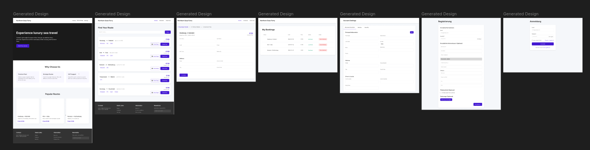

# Ferry

## Contributors
Leaaep und Francesco

## Description
A Ferry app.

## Setup
### Run app with Docker
1. Create .env file and fill in the following credentials:

```
# credentials to run on docker
DB_USERNAME=username
DB_PASSWORD=password
DB_NAME=dbName

# secret for session handling
SECRET_KEY=random-string
```
2. Start in production mode (Recommended):
```shell
docker compose -f docker-compose.prd.yaml up -d --build
```

3. Frontend: http://localhost:5173/
4. MailDev (Catches emails from server) http://localhost:1080

---
### Run app Locally (Dev)
1. Complete the upper steps and only start the DB. Otherwise, the ports are blocked.
2. Create a .env in the directory src/server/.env and fill it with the following credentials:

> Note: The credentials in both `.env` files need to match!

### Install dependencies
```shell
cd src/client
npm i

cd src/server
npm i
```


```
# credentials to run locally (MongoDB in Container)
DB_USERNAME=<username>
DB_PASSWORD=<password>
DB_NAME=<dbName>

# secret for session handling
SECRET_KEY=<random-string>
```
3. Start Services:
```shell
cd src/server
npm run server
```

```shell
cd src/client
npm run client
```
3.1 (Alternative)  Start as development containers:
```shell
docker compose up -d --build
```

4. http://localhost:5173/

## Links
* [Figma](https://www.figma.com/design/Jg19r4zo6lJeaKQBWpHfQ5/Ferry?node-id=0-1&t=TGgfaO7ASuuUqsCx-1)
* [MongoDB Cheatsheet](https://gist.github.com/bradtraversy/f407d642bdc3b31681bc7e56d95485b6)
* [MongoDB Doc](https://www.mongodb.com/developer/products/mongodb/cheat-sheet/)

## Images
* 
